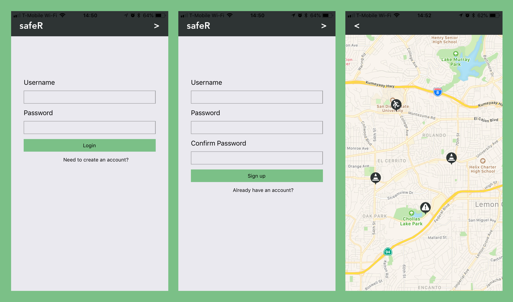
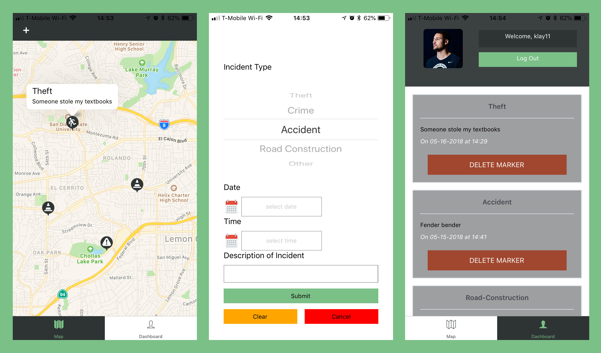

# safeR
SafeReport/safeR is an app that aims to keep the community safer by making sure they are up to date on local crimes or incidents in the area. When the app loads the user is greeted with a map with reports pinned in their local area. If the user chooses to sign up and login, they can submit a report or view the dashboard for previous reports they submitted themselves.

### Links
* Live App: https://safer.netlify.com/
* Github Client: https://github.com/thinkful-ei18/maajac-client
* Github Server: https://github.com/thinkful-ei18/majaac-server
* Github Mobile: https://github.com/thinkful-ei18/MOBILE-maajac-client

### Tech Stack
#### Front End
* React Native
* Redux
* React Maps
#### Back End
* Node
* Express
* Mongoose
* MongoDB
* Mocha
* Chai

### Logged Out User Interface

### Logged In User Interface

### Demo

